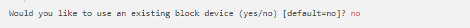

**1.**
# Miniproyecto Sistemas Operativos

**Autor:** Cristian Alejandro Morales Lopez

**Codigo:** A00328064

**Coreo** cristianalejandromoraleslopez@gmail.com

**Repositorio GitHub=** https://github.com/camtelematica/so-project.git

# Descripcion:

En este readme podran encontrar el despliegue de 2 servidores web y un balanceador de carga utilizando contenedores  LXC/LXD. se utilizara la maquina virutal
corriendo sobre ella el sistema operativo Ubuntu 16.04.4 LTS (xenial).

para lo siguiente se descargo la imagen ISO ubuntu-16.04.4-desktop-amd64 y se realizaran las siguientes configuraciones en virtual Box

SISTEMA BASE 


SISTEMA PROCESADOR (SE UTILIZAN 4 NUCLEOS)


INTERFACES DE RED se utiliza un adaptador y el adaptador 2 como adaptador puente


Se enciende la maquina virtual y se procede con la instalacion de ubuntu

1. se seleciona la primera Opcion


2 se seleciona la forma de instalacion


3 se seleciona el lugar de instalacion 


4 se seleciona la disposicion del teclado 


5 finalmente se configura el usuario y se descarga el sistema operativo por completo 


**Instalación de LXC/LXD con permisos para el usuario operativos**

La guia tutorial How to Set Up and Use LXD on Ubuntu 16.04 que se encuentra en el enlace: 
https://www.digitalocean.com/community/tutorials/how-to-set-up-and-use-lxd-on-ubuntu-16-04, sobre la 
cual hemos basado este informe para la instalaciion de lo servidores web. a continuacion se los pasos 
para la respectiva configuracion

1. Se crea el usuario operativos
  ```
  usermod -aG sudo operativos
  ```
2. Se adiciona el usuario a el grupo lxd, asi es posible usar el administrador de todos los contenedores.
  ```
  $ sudo usermod --append --groups lxd operativos
  ```
3. Se cierra sesión y se loguea de nuevo para actualizar los cambios. Una vez se loguea de nuevo, se puede iniciar a configurar el LXD.

4. Se actualiza la lista de paquetes disponibles y sus versiones.
  ```
  $ sudo apt-get update
  $ sudo apt-get install zfsutils-linux
  ```
  
5. Ahora se puede configurar el LXD. Para arrancar el proceso de iniciación de LXD se ejecuta el comando:
  ```
  $ sudo lxd init
  ```
  
6. El sistema solicita que se especifique los detalles para el backend de almacenamiento. Una vez se complete esa configuración,se  configurará la red para los contenedores.
  * En primer lugar es necesario crear un storage pool. Un **Storage Pool** es un conjunto de discos en el que el servidor de Data Protection Manager (DPM) almacena réplicas, instantáneas y registros de transferencia. Los storage pool pueden configurarse en diferentes tamaños y proporcionar una serie de beneficios, que incluyen mejoras de rendimiento, administración y protección de datos.


* Luego se nos pide el nombre de backend de almacenamiento, y el sistema ofrece dos opciones: dir o zfs. 
  La opción **dir** le dice a LXD que almacene contenedores en directorios en el sistema de archivos del servidor. 
  La opción **zfs** usa el sistema de archivos combinados ZFS y el administrador de volúmenes lógicos. Al usar zfs, obtenemos eficiencia de almacenamiento y una mejor capacidad de respuesta. Por ejemplo, si creamos diez contenedores a partir de la misma imagen de contenedor inicial, todos usan el espacio de disco de una sola imagen de contenedor. A partir de ese  
   momento, solo se almacenarán sus cambios en la imagen del contenedor inicial en el backend de almacenamiento.
   


* Se crea el pool **zfs** y se le asigna el nombre **lxd** al pool


 * El sistema solicitará si se desea utilizar un dispositivo de bloque existente.
 

 
 * Si selecciona la opción YES debe decirle al LXD donde encontrar este dispositivo. Si dice NO, LXD  usará un directorio pre-asignado para el almacenamiento de los contenedores. Para este proyecto se selecciono la opción NO y se asigno el tamaño por defecto 15.
 


7. Una vez se configura el backend de almacenamiento, se configura la red para LXD


* se acepta la configuracion del puente 


 
   Se realizan las siguientes configuraciones:
  * Se preguntará al usuario por el nombre del puente. Se aceptará el valor por defecto.
   
  * Se preguntará  la configuración para IPv4 y IPv6. Escogeremos solo IPv4.
  * Cuando se pregunte sobre la configuracion subnet IPv4, se escogera YES. El sistema informará sobre una configuración random de   subnet.Se selecciona OK para continuar.
  * Se solicitará una dirección IPv4, se acepta el valor por defecto.
  
  

  * Se solicitará una mascara valida, se acepta el valor por defecto.
  
  

  * Se solicita la primera dirección DHCP, se acepta el valor por defecto. Se hace lo mismo para la ultima dirección DHCP.
  
  
  
  
  
  
  
  
 
  * Se selecciona YES cuando pregunta hacer NAT al tráfico IPv4.
  
  
  * Cuando pregunta la configuración de subnetting para IPv6, seleccionar NO.
 


**5.**
# INSTALACION DE CONTENEDORES LXC/LXD
   Si se configuro como anteriormente se mostro; el primer contenedor esta listo para ser creado y administrado.
   
1. El siguiente comando se utiliza para verificar los contenedores instalados y disponibles.


2. Se crean e inician los contenedores con Ubuntu 16.04 con el nombre webserver2 adicionalmente a esto se crea un contenedor adicional para el balanceador de carga.
  ```
  lxc launch ubuntu:x webserver1
  lxc launch ubuntu:x webserver2
  lxc launch ubuntu:x loadBalancer
  ```
  
 3. Ahora que los contenedores se estan ejecutando, se usa el comando lxc list para mostrar la información al respecto.
  
  
  
  4. Se Configura el servidor web en cada contenedor Nginx
    ```
    lxc exec webserver-- sudo --login --user ubuntu
  
    lxc exec webserver2-- sudo --login --user ubuntu
     ```
     
5. Una vez dentro del contenedor, el shell prompt se vera de la siguiente manera:

  
  
6. Para configurar Nginx en este contenedor, se actualiza el paquete dentro del contenedor y se instala nginx

  
  
7. Se edita la página por defecto del servidor web WEBSERVER y WEBSERVER2 mediante el siguiente comando en cada shell:  


 Se hace el siguiente cambio en ambos archivos archivo: 


8.Se reinicia el servicio nginx y salimos del contenedor, usando el comando:
    ```
    sudo service nginx restart
    logout
    ```

**6.**

# CREACIÓN DE CONTENEDOR CON SERVICIO DE BALANCEO DE CARGA

1. anteriormente se habia creado el contenedor para el balanceador de carga

2. Para configurar el balanceador de carga se ejecuta el siguiente comando


3. Para configurar Nginx en este contenedor, se actualiza el paquete dentro del contenedor y se instala nginx

 
 
4. Se configura el balanceador de carga mediante el siguiente comando:

 

   Se edita el archivo, para configurar el bloque de servidores a los que se les hará las peticiones  
  
   

5. Se debe eliminar la página por default, para que cuando se hagan solicitudes al balanceador no retorne la pag html y reiniciar el servicio nginx


    
 6. Se debe configurar el balanceador de carga para recibir conexiones remotas: Para esto se debe alterar la iptable, que es la que permite el intercambio de tráfico entre el http del host y el contenedor de balanceador de carga.
  ```
  sudo iptables -t nat -A PREROUTING -p tcp -m conntrack --ctstate NEW --dport 80 -j DNAT --to-destination 10.213.254.175:80  
  ```
  
7. Mediante el comando systemctl se valida que el servicio queda activo
  ```
  systemctl list-unit-files --state=enabled | grep lxd
  ```
 


**7.**
# SALIDA DEL COMANDO LXC LIST CON LOS CONTENEDORES CREADOS Y SUS DIRECCIONES IP 


**8.**
# PRUEBAS DEL FUNCIONAMIENTO DEL BALANCEADOR
1. A continuación se muestra por medio del uso del comando curl la respuesta de cada uno de los servicios web a través del balanceador.
  


 Por medio de la herramienta de stress SIEGE se evalue el desempeño del sistema con las siguientes configuraciones:
  * Servidores web con 64Mb, 128Mb
  * Servidores web con 50%CPU, 100%CPU
  
  Para llevar a cabo estas pruebas debo se realizan los siguientes pasos:
  * Instalar Siege
  ```
  sudo apt-get install siege  
   ```  
  * Se configura la CPU y la memoria RAM de los contenedores mediante los siguientes comandos:
  
  CPU 
  ```
  lxc config set webserver# limits.cpu.allowance 100%
  lxc config set webserver# limits.cpu.allowance 50%
  ```

  Memoria RAM
  ```
  lxc config set webserver# limits.memory 64MB
  lxc config set webserver# limits.memory 128MB
  ```
  
  * Se ejecuta el siguiente comando, para cada combinacion:
  ```
  siege -c 100 -t 30s http://10.96.73.31 
  ```
  De acuerdo a lo anterior se obtuvieron los siguientes resultados:
    
  **CPU 100% MEMORIA 64MB - WEBSERVER**  


  
  **CPU 100% MEMORIA 128MB - WEBSERVER**
  
  

  **CPU 50% MEMORIA 64MB - WEBSERVER**
  
 
 
  **CPU 50% MEMORIA 128MB - WEBSERVER**
  
  
  
**CPU 100% MEMORIA 64MB - WEBSERVER2**


  **CPU 100% MEMORIA 128MB - WEBSERVER2**
  
  
  
  **CPU 50% MEMORIA 64MB - WEBSERVER2**
  
  
  
  **CPU 50% MEMORIA 128MB - WEBSERVER2**
  
  

**9.**
## CONFIGURACIÓN DEL REENVIO DE PUERTOS EN LA MÁQUINA VIRTUAL PARA PERMITIR EL ACCESO DESDE EL SISTEMA ANFITRIÓN HACIA EL CONTENEDOR CON EL SERVICIO PARA BALANCEO DE CARGA

  La última pieza del rompecabezas es conectar el contenedor del servidor web a Internet. Nginx está instalado en un contenedor y, de     forma predeterminada, no es accesible desde Internet. Es necesario configurar el servidor para reenviar cualquier conexión que pueda     recibir de internet en el puerto 80 al contenedor del servidor web. Para hacer esto, se crea una regla de iptables para reenviar las     conexiones.
  Para permitir las peticiones al balanceador de carga desde el SO anfitrión se debe crear una regla de FORWARDING en el SO Ubuntu, por   medio del siguiente comando:
  1.  Declarar la dirección ip pública y la del contenedor que tiene el balanceador de carga, especificando el puerto.
  ```
  PORT=80 PUBLIC_IP=190.251.51.236 CONTAINER_IP=10.96.73.130 

   ```  
   2. El comando iptables requiere dos direcciones IP: La IP publica del servidor y la IP privada del contenedor nginx  
  ```
  sudo iptables -t nat -I PREROUTING -i enp0s8 -p TCP -d $PUBLIC_IP --dport $PORT -j DNAT --to-destination $CONTAINER_IP:$PORT -m     
  comment --comment "forward to the Nginx container"
  ```
  3. Para comprobar el acceso desde el sistema anfitrión hacia el contenedor, se inicia el navegador y se ingresa la dirección IP   pública para hacer las peticiones, obteniendo el siguiente resultado:  
  

  
  Si se actualiza la página del navegador se obtiene lo siguiente:
  

 


 # BIBLIOGRAFIA
  
  - REPOSITORIOs GITHUB                                                                                                                   
    URL: https://github.com/ICESI                                                                                                       
    URL: https://github.com/ICESI-Training
  
  - Ubuntu 16.04.4 LTS (Xenial Xerus)
  
    URL: http://releases.ubuntu.com/16.04/
  
  - How to Set Up and Use LXD on Ubuntu 16.04
  
    URL: https://www.digitalocean.com/community/tutorials/how-to-set-up-and-use-lxd-on-ubuntu-16-04
  


    


